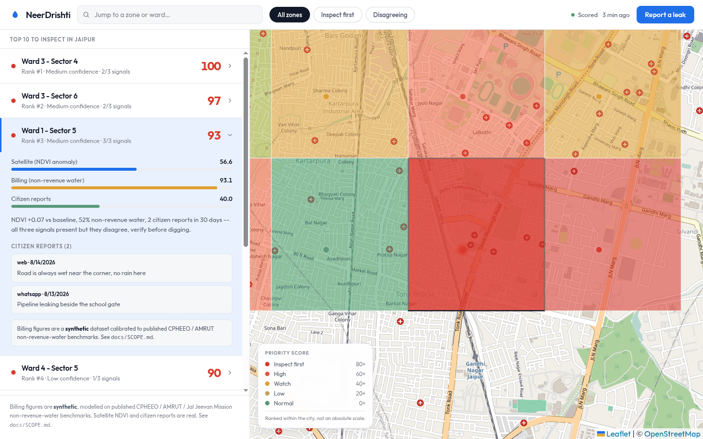
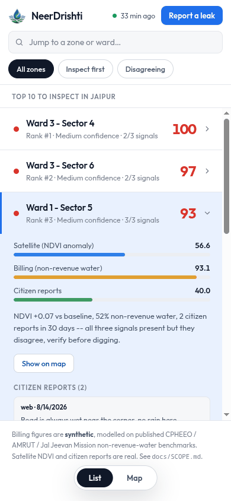
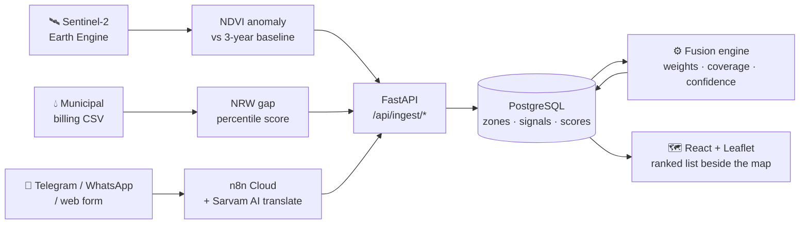

<div align="center">


# NeerDrishti AI

### Find underground water leaks without burying a single sensor

**Decode SIH 2026 · Bharat Nirman · PS3 — Smart Water Intelligence System**
Team Zeniths

<br/>

[](https://github.com/OfficialAbhinavSingh/Decode-SIH-2026-Team-Zeniths/actions/workflows/ci.yml)
[](https://github.com/OfficialAbhinavSingh/Decode-SIH-2026-Team-Zeniths/actions/workflows/pr-checks.yml)
[](LICENSE)


**[Live dashboard](https://neerdrishti-web.onrender.com)** ·
**[API](https://neerdrishti-api.onrender.com/docs)** ·
**[Demo script](docs/DEMO.md)** ·
**[How to contribute](CONTRIBUTING.md)**

</div>

<br/>



<div align="center">
<sub>The real app against real data. Rank #3 expanded: its Sentinel-2, billing and citizen
scores, and the engine's own sentence about how much they agree.</sub>
</div>

<details>
<summary><b>On a phone</b> — the two panes become one view at a time</summary>

<br/>
<div align="center">

</div>

</details>

---

## The problem

India loses a large share of its treated water before it reaches a tap. Finding the leak
normally means burying acoustic sensors along the network — capital most municipal budgets
simply do not have.

## The idea

Three signals a city **already has, for free**, none of which is reliable alone.

| | Signal | Source | What it tells us | Alone, it misses… |
|:--:|---|---|---|---|
| 🛰️ | **Satellite** | Sentinel-2 NDVI over the zone, via Google Earth Engine | Soil above a leaking pipe stays wetter, so it stays greener than its own history | Leaks under tarmac. Nothing greens. |
| 💧 | **Billing** | Water supplied vs water billed, per zone (NRW) | A large gap means water is disappearing somewhere in that zone | *Where* in the zone. And it cannot tell a leak from a meter fault. |
| 📱 | **Citizen** | Telegram / WhatsApp / web reports, any Indian language | Ground truth — somebody actually saw water | Everywhere nobody happened to look. |

Each is scored `0–100` per zone. A fusion engine combines whichever are present into one
**priority score**, a **confidence level**, and a sentence explaining itself.

> ### 📍 What the product actually outputs
>
> **Ward 1 - Sector 5** — priority **93/100**, rank 3 of 30, **medium** confidence.
> *NDVI +0.07 vs baseline, 52% non-revenue water, 2 citizen reports in 30 days — all three
> signals present but they disagree, verify before digging.*
>
> Not "there is a leak here". A ranked place to send a crew, and an honest statement of how
> much the evidence agrees with itself.

---

## How it fits together



<details>
<summary><b>The fusion rule, in full</b> — the one thing all six of us must be able to defend</summary>

<br/>

```
weights  = { satellite: 0.40, billing: 0.35, citizen: 0.25 }
coverage = { 1 signal: 0.70, 2 signals: 0.90, 3 signals: 1.00 }

present      = the signals that actually have a row for this zone
mean         = Σ w[s]·score[s]  /  Σ w[s]      for s in present
fusion_score = mean × coverage[len(present)]

confidence   = high   if 3 signals and (max − min) ≤ 25
               medium if 2 or more signals
               low    if 1 signal
```

**Renormalisation** means a missing signal is *absent*, not zero — a zone is never punished
to 40% of its score for billing the city never digitised.

**The coverage discount** stops that generosity going too far. Without it, one unverified
billing reading of 86 scores exactly what three sources agreeing at 86 score, and a lone
number can top the repair list. A single satellite reading of 90 lands at **63** — not 36,
and not 90. A lead stays visible; it just cannot outrank corroboration.

Scores are then **percentile-ranked within the city**, so the map has real colour spread
instead of every zone sitting at 60.

Full contract: [`docs/DATA-CONTRACT.md`](docs/DATA-CONTRACT.md).

</details>

---

## 🔎 What is real, and what is not

We label this everywhere, including on the dashboard itself, unprompted. Being caught
overstating is worse than the gap.

| Data | Status | Detail |
|---|---|---|
| Satellite NDVI | 🟢 **Real** | Sentinel-2 L2A via Google Earth Engine. **21 of 30 zones** have a usable observation for 25 Aug 2026 — the other nine were fully cloud-masked and carry no satellite signal at all, rather than an invented one. |
| Zone polygons | 🟡 **Demonstration set** | A 30-cell grid over Jaipur, not real ward geometry. The pipeline accepts any polygon set. |
| Billing / NRW | 🔴 **Synthetic** | Generated from published CPHEEO / AMRUT / Jal Jeevan Mission benchmarks. Every row carries `is_synthetic = true`. Generator: [`backend/pipelines/billing/generate.py`](backend/pipelines/billing/generate.py). |
| Citizen reports | 🟡 **Mixed** | The intake path is live end to end and was verified against production on 29 Aug 2026 — a Telegram message in Hindi, translated by Sarvam AI, reaching the API as a real `citizen_reports` row, with the ticket number in the resident's reply equal to that row's database id. The reports sitting in the demo database are seeded. |
| Deployment | 🟢 **Live, on the real data** | Re-verified 30 Aug 2026. `GET /api/zones/Z-005/signals` on the hosted API returns `"source": "sentinel2-gee"` with a real NDVI mean and baseline, and every billing row carries `is_synthetic: true`. Cloud-masked zones return `"satellite_score": null` rather than a filler number — you can check that yourself on the live API without cloning anything. |

---

## 🧯 What we caught in our own system

Every one of these was **our code confidently reporting something untrue**, found by testing
against a running instance rather than by reading the code. They are listed here on purpose:
the failure mode this project has to defend against is not "the score was 3 points off", it
is "the system stated a fact it had not earned".

| What it claimed | What was actually happening | Fix |
|---|---|---|
| Every zone had a satellite reading | `seed.py` handed all 30 zones an invented NDVI row, so the nine zones that were **fully cloud-masked** on 25 Aug looked identical to the 21 that were really observed — and one of them sat at the top of the repair list | `seed.py --skip satellite`; fusion treats a missing signal as *absent*, not zero |
| Priority **100/100** | A single unverified billing reading scored exactly what three agreeing sources scored, so one number could top the list on its own | Coverage discount — 1 signal × 0.70, 2 × 0.90, 3 × 1.00 ([#11](https://github.com/OfficialAbhinavSingh/Decode-SIH-2026-Team-Zeniths/pull/11)) |
| A zone was 6th-highest priority in the city | `/help`, `Hello?`, `Pothole` and `Pothole damage` were all counting as leak evidence, carrying that zone to **rank 6 of 30** ahead of zones with real satellite data | A deliberately **fail-open** relevance filter — anything it cannot confidently categorise still counts, including languages it has no keywords for ([#14](https://github.com/OfficialAbhinavSingh/Decode-SIH-2026-Team-Zeniths/pull/14)) |
| Two independent reports | The same resident messaging twice was scored twice | 6-hour per-reporter dedup window; `duplicate` rows are stored for audit but excluded from scoring ([#13](https://github.com/OfficialAbhinavSingh/Decode-SIH-2026-Team-Zeniths/pull/13)) |
| *"✅ Ticket #6621 · Zone Z-001 (Ward 1) · Dispatched to Ward Repair Crew"* | The bot's reply was **entirely invented** — `Math.random()` for the ticket, a hardcoded zone, a crew that was never dispatched — and it was sent even when the API call had failed and nothing was stored at all | The receipt now reads the real API response: real row id, real matched zone, real status, and an explicit *"we could not log this"* when the write failed |
| Phone numbers were SHA-256 hashed | The hash was a 32-bit rolling loop with **24 constant hex characters** glued on the end, so every hash shared the same tail | Real SHA-256, salted from an n8n variable |
| A report from a resident with no GPS | Missing coordinates silently defaulted to Jaipur city centre, turning "somewhere" into a specific zone | Coordinates stay `null`; the bot replies asking the resident to resend with a location pin |

**These are held in place by tests, not by memory.** `automation/n8n/tests/` parses the
*committed workflow JSON itself* — so if a workflow is re-exported from n8n Cloud and quietly
reintroduces a random ticket number, a hardcoded zone, a fake hash or a plaintext bot token,
CI fails on the pull request.

<details>
<summary><b>It also runs with the internet physically off</b> — rehearsed, not assumed</summary>

<br/>

A judge's venue Wi-Fi is a single point of failure for a demo, so we removed it as one.
With the machine disconnected, a cold `docker compose up` reaches a healthy API in **6
seconds**, serves all 30 zones and accepts a new citizen report; the dashboard detects that
map tiles cannot be fetched, falls back to a **bundled basemap image** of Jaipur, draws every
zone polygon over it, and shows an offline badge rather than a grey void
([#15](https://github.com/OfficialAbhinavSingh/Decode-SIH-2026-Team-Zeniths/pull/15)).

Two problems surfaced only because we actually pulled the plug: the API image had never
been built locally, and port 8000 was already taken on the demo machine. Both are now
warnings in [`docs/DEMO.md`](docs/DEMO.md) and checks in `scripts/verify-demo.sh`.

</details>

---

## 🚀 Run it locally

<details open>
<summary><b>Quickstart</b> — about 10 minutes</summary>

<br/>

```bash
git clone https://github.com/OfficialAbhinavSingh/Decode-SIH-2026-Team-Zeniths.git
cd Decode-SIH-2026-Team-Zeniths

# 1 · Database
docker compose up -d db

# 2 · Backend
cd backend
python -m venv .venv && source .venv/bin/activate
pip install -r requirements.txt
cp .env.example .env
python -m app.init_db
uvicorn app.main:app --reload          # loaders POST to the API — start it FIRST
```

```bash
# 3 · Data, in a second terminal
cd backend
python seed.py --skip satellite        # keep the real NDVI, skip the placeholder rows
python -m pipelines.satellite.load ../data/samples/ndvi_export.csv
python -m pipelines.billing.load  ../data/samples/billing.csv
curl -s -X POST localhost:8000/api/fusion/run

# 4 · Frontend
cd ../frontend && npm install && npm run dev     # http://localhost:5173
```

> **The loaders use relative imports — run them with `python -m`.**
> `python pipelines/satellite/load.py …` fails with `ImportError`.

Want a working demo with zero real data? Plain `python seed.py` seeds all three signals and
the dashboard comes up fully populated. Full guide: [`docs/SETUP.md`](docs/SETUP.md).

</details>

<details>
<summary><b>Run the tests</b></summary>

<br/>

```bash
cd backend            && python -m pytest tests/ -q      # 70 passed, 11 skipped
cd automation/n8n     && python -m pytest tests/ -q      # 31 passed
cd frontend           && npm run build                   # must be clean
```

And one read-only script that checks a running instance still matches every number the
demo script reads aloud — 15 assertions, changes nothing, safe to run in front of anyone:

```bash
./scripts/verify-demo.sh
```

</details>

---

## 🗂 Repo map

```
├── backend/
│   ├── app/                  FastAPI · models · fusion engine
│   ├── pipelines/satellite/  Earth Engine export → NDVI anomaly score
│   ├── pipelines/billing/    NRW generator + loader
│   └── seed.py               offline demo data (--skip lets real pipelines win)
├── frontend/                 React + Leaflet · ranked list beside the map
├── automation/n8n/           citizen intake · Sarvam AI translation · alerts
├── data/samples/             zones, the real NDVI export, billing CSV
├── scripts/verify-demo.sh    read-only pre-demo check · 15 assertions
├── docs/                     ← six documents, read these first
└── .github/                  CI · PR template · CODEOWNERS
```

## 📚 Documentation

| | Read when |
|---|---|
| **[SCOPE.md](docs/SCOPE.md)** | You want to know what ships by 5 Sep — and what we deliberately do not build |
| **[ROLES.md](docs/ROLES.md)** | First day. Find your name, read only your section |
| **[SETUP.md](docs/SETUP.md)** | Getting it running locally |
| **[DATA-CONTRACT.md](docs/DATA-CONTRACT.md)** | **The one thing all six of us must agree on.** Tables + API shapes + the fusion rule |
| **[ARCHITECTURE.md](docs/ARCHITECTURE.md)** | You need to know how the pieces connect |
| **[DEMO.md](docs/DEMO.md)** | Before you present. Every number verified against a running instance |

## 👥 Lanes

| Lane | Owner | Owns |
|---|---|---|
| 🛰️ **R1** Satellite & Geo | [@OfficialAbhinavSingh](https://github.com/OfficialAbhinavSingh) | `backend/pipelines/satellite/`, zone GeoJSON |
| 💧 **R2** Data · Billing / NRW | [@sayali-rathod-07](https://github.com/sayali-rathod-07) · [@Saksham0423](https://github.com/Saksham0423) | `backend/pipelines/billing/` |
| ⚙️ **R3** Backend & Fusion | [@OfficialAbhinavSingh](https://github.com/OfficialAbhinavSingh) · [@Kr0issant](https://github.com/Kr0issant) | `backend/app/` |
| 🗺️ **R4** Frontend & Dashboard | [@Abhi1818Singh](https://github.com/Abhi1818Singh) | `frontend/` |
| 🤖 **R5** Automation · n8n | [@PranjaySrivastava](https://github.com/PranjaySrivastava) | `automation/n8n/` |
| 🚢 **R6** DevOps & Deploy | [@Kr0issant](https://github.com/Kr0issant) | `render.yaml`, `docker-compose.yml`, `.github/` |

---

## ⚖️ Working agreement

**Full rules: [`CONTRIBUTING.md`](CONTRIBUTING.md). Compulsory, every change, no exceptions.**

- 🔒 **`main` is protected**, and not just as a stated intention. GitHub enforces one
  approving review, dismissal of stale reviews, resolution of every review thread, and five
  status checks that must pass before merge is even offered:
  **PR hygiene · Secret scan · Backend lint + tests · Frontend build · Offline demo fallback still works**.
- 👤 **[@OfficialAbhinavSingh](https://github.com/OfficialAbhinavSingh) reviews and merges every PR.** Nobody self-merges.
- 🌿 Branch `<type>/<lane>-<thing>` — e.g. `feat/r1-ndvi-baseline-composite`.
- 📝 Fill in **every** section of the PR template. CI rejects a half-filled one.
- 🤖 **If an AI agent wrote it, declare it** ([§7](CONTRIBUTING.md#7-ai-agent-disclosure--compulsory)). Undeclared agent work is closed unmerged.
- 🚧 Stay in your lane, or get the owner's approval ([CODEOWNERS](.github/CODEOWNERS)).
- 📐 `docs/DATA-CONTRACT.md` changes need a heads-up to the whole team first.
- 🔑 **Never commit a secret** ([`SECURITY.md`](SECURITY.md)).

<div align="center">
<br/>

[Contributing](CONTRIBUTING.md) · [Security](SECURITY.md) · [Code of conduct](CODE_OF_CONDUCT.md) · [MIT](LICENSE)

<sub>Built by Team Zeniths for Decode SIH 2026.</sub>

</div>
